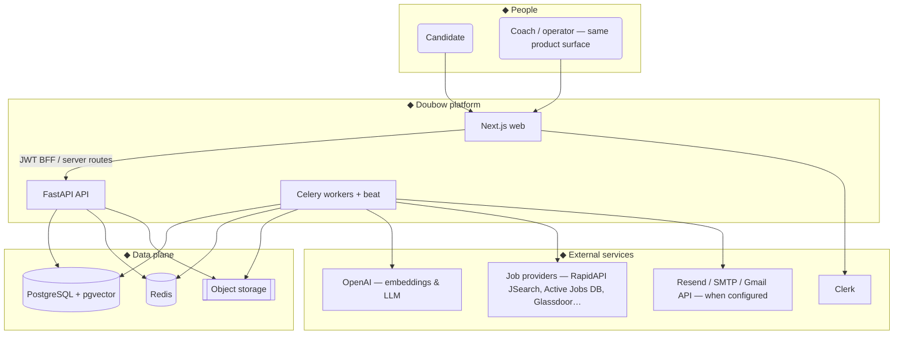
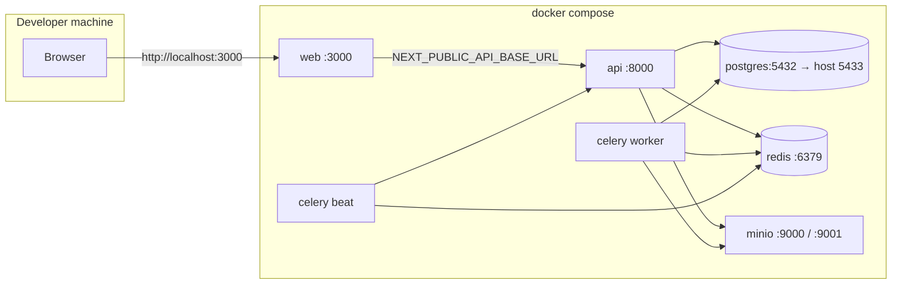
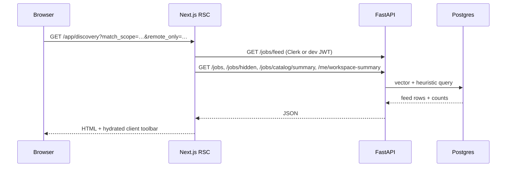
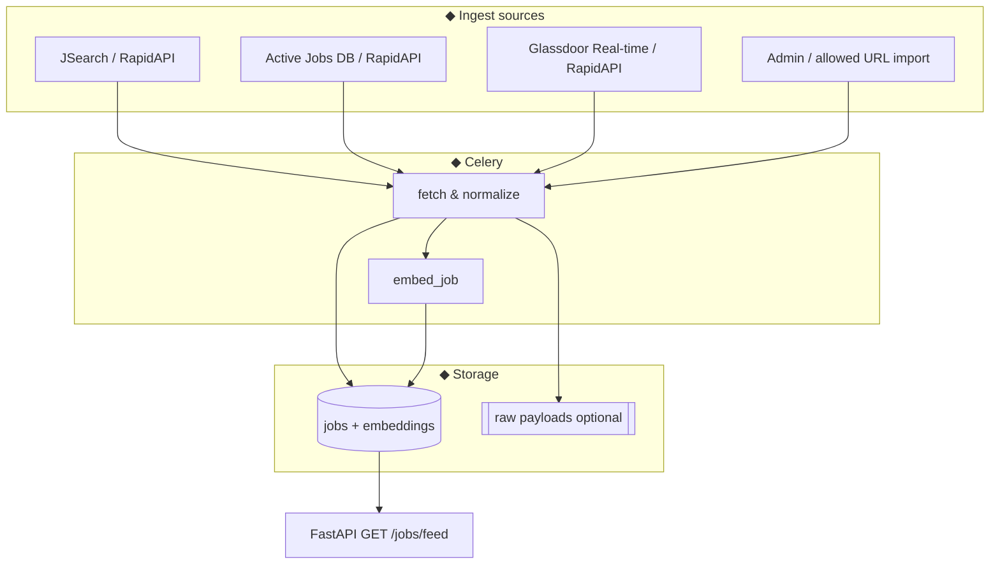
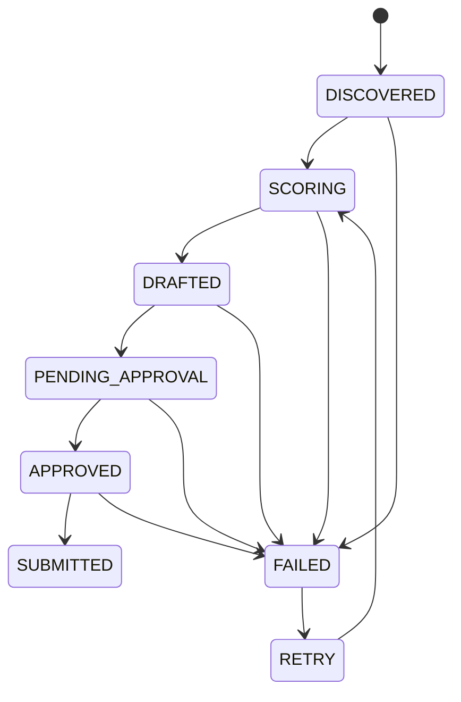

# Doubow — High-level architecture

<div align="center">

**AI-assisted job search workspace · human-in-the-loop for every outbound action**

[](https://nextjs.org)
[](https://fastapi.tiangolo.com)
[](https://www.postgresql.org)
[](https://redis.io)
[](https://docs.celeryq.dev)
[](https://clerk.com)
[](https://min.io)

</div>

---

## ◇ Executive summary

Doubow unifies **discovery**, **scoring**, **drafting**, **approval**, and **tracking** in one workspace. The architectural guarantee from the product brief (see local planning copies under `.tmp/`, e.g. `doubow_prd.txt`) is simple:

> **Nothing is sent on the user’s behalf until the application record is explicitly approved and submitted through the API.**

The web app is **Next.js** (App Router, React 19) with **Clerk** for identity. The **FastAPI** service owns business rules, the **Postgres + pgvector** catalog, embeddings, and the **application state machine**. **Celery** workers drain **Redis** queues for ingest, scoring, drafts, and notifications. **S3-compatible storage** holds résumé binaries and optional raw ingest artifacts.

---

## ◇ Design principles (product ↔ engineering)

| Principle | How it shows up in this repo |
|-----------|------------------------------|
| **Human-in-the-loop** | Drafts require review; `POST …/submit` is **403** unless status is **APPROVED** (`api/app/state_machine.py`, `api/app/api/applications.py`). |
| **Résumé as source of truth** | Parse + embed pipeline on `ResumeDocument`; discovery feed blends vector similarity with heuristics (`api/app/jobs/matching.py`, `GET /jobs/feed`). |
| **One system** | Single Postgres schema for users, profiles, jobs, applications, drafts, milestones, check-ins, LLM logs. |
| **Observable** | LLM / agent calls logged for auditing and replay. |
| **Safe at scale** | `IdempotencyMiddleware` on the API; Celery DLQ key for poison messages (`api/app/middleware/idempotency.py`, settings). |

---

## ◇ System context

Actors and external systems the workspace integrates with.



---

## ◇ Container view (local Docker Compose)

Typical developer topology. **Postgres is published on host `5433`** so it does not collide with a local Postgres on `:5432`.



Service highlights (see root `docker-compose.yml`):

| Service | Role |
|---------|------|
| **web** | Next dev server; calls API via public base URL. |
| **api** | REST + optional startup ingest bootstrap. |
| **worker** | Queues: `default`, `scrape`, `score`, `draft`, `notify`. |
| **beat** | Periodic ingest / housekeeping schedules. |
| **postgres** | `pgvector/pgvector:pg16`, DB `doubow`. |
| **minio** | Local S3 stand-in for résumé and raw objects. |

---

## ◇ Job discovery & feed (recent product/engineering surface)

Server-driven ranking parameters exposed on **`GET /jobs/feed`**:

- **`match_scope`**: `worldwide` lowers geography weight versus default “balanced” blending.
- **`remote_only`**: filters to listings whose location text matches remote-style heuristics.

The Next.js **Job Discovery** page reads these from the URL, merges personalized feed rows with recent catalog rows, and applies a **client-side** filter for the “Saved” tab (stars in-session / feedback API).



---

## ◇ Catalog ingest pipeline (conceptual)

Aligned with the pipeline story in `.tmp/job_data_pipeline_architecture.svg` and `doubow_job_index_pipeline.svg` (local, not in git): **sources → normalize → dedupe → persist → embed → serve**.



---

## ◇ Application state machine (outbound safety)



**Submit** transitions only from **APPROVED**; enforcement is in the API handler, not only the UI.

---

## ◇ Web client architecture (UI motion & icons)

- **Framer Motion** for page and component transitions (e.g. discovery cards, workspace chrome).
- **Central icon set** in `web/src/components/ui/app-icon.tsx` (stroke icons shared across navigation, discovery, and tools).
- **App shell**: sidebar + top bar + command palette (`web/src/components/app/`, `web/src/middleware.ts` Clerk gate for `/app` and `/onboarding`).

---

## ◇ API surface (routers)

Mounted in `api/app/main.py`:

| Router | Concern |
|--------|---------|
| `auth` | Signup / login JWT for dev and tests. |
| `me` | Profile, résumé, dashboard summaries, **account deletion** (S3 sweep + `User` delete with profile cascade). |
| `me_google` / `me_linkedin` | Optional OAuth token bridges. |
| `jobs` | Catalog, feed, fit, feedback, admin ingest gates. |
| `applications` | Pipeline, drafts, approve/reject, submit, WebSocket updates. |
| `copilot` | Career assistant agent and tools. |

Cross-cutting: **CORS**, **idempotency**, optional **startup ingest** bootstrap.

---

## ◇ Configuration quick reference

| Variable family | Purpose |
|-----------------|--------|
| `DOUBOW_DATABASE_URL` | Postgres + psycopg driver DSN. |
| `DOUBOW_REDIS_URL` | Celery broker and DLQ. |
| `DOUBOW_OPENAI_API_KEY` | Résumé + job embeddings and LLM features. |
| `DOUBOW_S3_*` / `DOUBOW_S3_ENDPOINT_URL` | AWS or MinIO. |
| `DOUBOW_CLERK_*` | Verify Clerk JWTs alongside local HS256 in dev. |
| `DOUBOW_ADMIN_INGESTION_USER_IDS` | Allow-list for bulk / sensitive ingest routes. |

---

## ◇ Related documents

| Doc | Content |
|-----|---------|
| [`docs/architecture/README.md`](docs/architecture/README.md) | Bookmark-friendly alias for this overview (redirect). |
| [`docs/mvp-definition-of-done.md`](docs/mvp-definition-of-done.md) | Honest MVP checklist vs repo (Stripe, ATS Optimizer, WCAG, load tests, GDPR gaps). |
| [`docs/LAUNCH_WEEK.md`](docs/LAUNCH_WEEK.md) | Production launch runbook (CORS, Clerk, workers, smoke tests). |
| `.tmp/*` (local only) | PRD, build plan, sprint HTML, pipeline SVGs — **not committed**; keep as design references. |

---

<div align="center">

**◇ Doubow — AI drafts. You decide. Nothing moves without you. ◇**

</div>

---

## Local development

### Prereqs
- Docker Desktop

### Run everything

```bash
docker compose up --build
```

- Web: `http://localhost:3000`
- API health: `http://localhost:8000/health`

### API tests (PostgreSQL)

Integration-style tests under `api/tests/` expect Postgres (same as `docker compose`). Use **Python 3.12 or 3.13** for the API venv: LangChain’s pinned stack is not compatible with **Python 3.14** yet.

```bash
cd api
UV_PYTHON=python3.13 uv sync
uv run pytest tests/test_job_get_api.py tests/test_milestones_api.py -q
```

`api/pyproject.toml` now lists dependencies so `uv sync` matches the app; `requirements.txt` remains a convenient flat list for non-uv workflows.

**Same tests as CI, locally with Compose DB/Redis:** `bash scripts/run-api-tests-compose.sh` (needs Docker; mounts `api/` into the `api` image so you run the code on your branch).

### Railway (production API)

- Public API: **`https://doubau-production.up.railway.app`** — **HTTP target / container port `8080`**, matching Railway’s default **`PORT=8080`** and **`scripts/start.sh`** (`uvicorn --port "$PORT"`; local Docker still defaults to **8000** when `PORT` is unset).
- If the dashboard **target port** were **8000** while the app listens on **8080**, you would see **502** from the edge even when deploy logs show Uvicorn started.
- **Postgres / Redis**: use each plugin’s **private** URL in **`DOUBOW_DATABASE_URL`** and **`DOUBOW_REDIS_URL`** on the API service only.

## Services
- `web/`: Next.js (marketing + app)
- `api/`: FastAPI (auth, state machine, workers later)

## Production launch (this week)
- **Runbook:** [`docs/LAUNCH_WEEK.md`](docs/LAUNCH_WEEK.md) — CORS, Clerk, workers, smoke tests.
- **Web env template:** `web/.env.example`
- **Pre-flight (web):** `cd web && npm run launch:check` (after exporting Vercel env)
- **Pre-flight (API):** `python api/scripts/check_launch_env.py` (after exporting Railway/API env)
- **CI:** GitHub Actions workflow `.github/workflows/ci.yml` (typecheck + Next build + API compile)
- **Catalog ingest:** [`docs/LAUNCH_WEEK.md`](docs/LAUNCH_WEEK.md) — Redis + OpenAI + Celery (`DOUBOW_START_WORKER_IN_API` / `DOUBOW_START_BEAT_IN_API` for one-container Railway); optional `DOUBOW_BOOTSTRAP_INGEST_ON_STARTUP`, `POST /jobs/cron/queue-ingest`, [`api/scripts/trigger_catalog_ingest.sh`](api/scripts/trigger_catalog_ingest.sh), [`.github/workflows/catalog-ingest.yml`](.github/workflows/catalog-ingest.yml)
